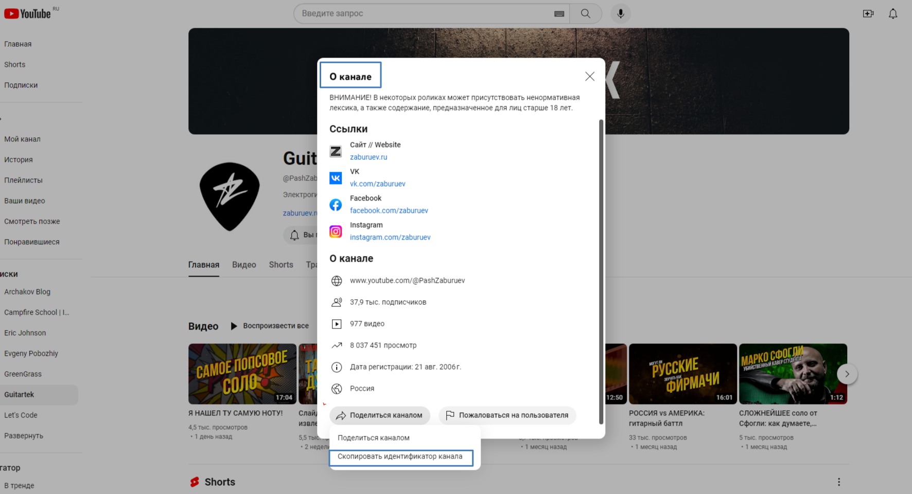
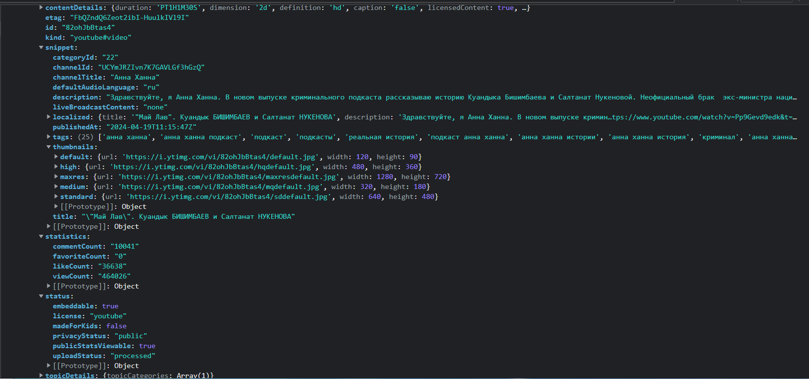

#### РАБОТАЕМ С YOUTUBE API V3 в создаваемом SPA:

#### [API-документация](https://developers.google.com/youtube/v3/docs/videos/list?hl=ru#videoCategoryId "Дока на русском")

1. https://www.youtube.com/watch?v=ArgZn_2hANE - сcылка на страницу с конкретным видео
2. https://www.youtube.com/embed/ArgZn_2hANE - источник конкретного видео (src <iframe src="сюда!"/>)

#### Как скопировать идентификатор канала:

- Переходим на гл. страницу канала
- Выбираем раздел 'О КАНАЛЕ':

1.  
2.  Пример ID канала Guitartek: UCe0CivunALluST1dUXnlv5g

#### HTML-шаблон для preview

```html
<iframe
  width="800"
  height="600"
  src="https://www.youtube.com/embed/ArgZn_2hANE"
  title="Я НАШЕЛ ТУ САМУЮ НОТУ!"
  frameborder="0"
></iframe>
```

## GOOGLE YOUTUBE V3 API INTRODUCTIONS AND TOPICS:

#### CHANNEL_URL_Guitartek:

https://developers.google.com/apis-explorer/#p/youtube/v3/youtube.channels.list?part=snippet,contentDetails
&id=UCe0CivunALluST1dUXnlv5g

#### Before you start

-You need a Google Account to access the Google API Console, request an API key, and register your application.

- Create a project in the Google Developers Console and obtain authorization credentials so your application can submit API requests.

- After creating your project, make sure the YouTube Data API is one of the services that your application is registered to use:

- Go to the API Console and select the project that you just registered.
  Visit the Enabled APIs page. In the list of APIs, make sure the status is ON for the YouTube Data API v3.
  If your application will use any API methods that require user authorization, read the authentication guide to learn how to implement OAuth 2.0 authorization.

- Select a client library to simplify your API implementation.

- Familiarize yourself with the core concepts of the JSON (JavaScript Object Notation) data format. JSON is a common, language-independent data format that provides a simple text representation of arbitrary data structures. For more information, see json.org.

#### Quota usage

The YouTube Data API uses a quota to ensure that developers use the service as intended and do not create applications that unfairly reduce service quality or limit access for others. All API requests, including invalid requests, incur at least a one-point quota cost. You can find the quota available to your application in the API Console.

Projects that enable the YouTube Data API have a default quota allocation of 10,000 units per day, an amount sufficient for the overwhelming majority of our API users. Default quota, which is subject to change, helps us optimize quota allocations and scale our infrastructure in a way that is more meaningful to our API users. You can see your quota usage on the Quotas page in the API Console.

#### EXAMPLES WORKING WITH 'part' and 'fields' PARAMETERS:

```javascript
// https://www.googleapis.com/youtube/v3/videos?id=7lCDEYXw3mM&key=YOUR_API_KEY&fields=items(id,snippet(channelId,title,categoryId),statistics)&part=snippet,statistics


// RESPONSE:
{
 "videos": [
  {
   "id": "7lCDEYXw3mM",
   "snippet": {
    "publishedAt": "2012-06-20T22:45:24.000Z",
    "channelId": "UC_x5XG1OV2P6uZZ5FSM9Ttw",
    "title": "Google I/O 101: Q&A On Using Google APIs",
    "description": "Antonio Fuentes speaks to us and takes questions on working with Google APIs and OAuth 2.0.",
    "thumbnails": {
     "default": {
      "url": "https://i.ytimg.com/vi/7lCDEYXw3mM/default.jpg"
     },
     "medium": {
      "url": "https://i.ytimg.com/vi/7lCDEYXw3mM/mqdefault.jpg"
     },
     "high": {
      "url": "https://i.ytimg.com/vi/7lCDEYXw3mM/hqdefault.jpg"
     }
    },
    "categoryId": "28"
   },
   "statistics": {
    "viewCount": "3057",
    "likeCount": "25",
    "dislikeCount": "0",
    "favoriteCount": "17",
    "commentCount": "12"
   }
  }
 ]
}

```

#### EXAMPLES WORKING WITH VIDEO ID-PARAMETER:

```javascript
{
    "kind": "youtube#videoListResponse",
    "etag": "unD4CF8W2Laklj1gI1di_iie9WY",
    "items": [
      {
        "kind": "youtube#video",
        "etag": "4SbSdbzexkCWtrGgWhQm5KjNvFg",
        "id": "ArgZn_2hANE",
        "snippet": {
          "publishedAt": "2024-04-15T09:06:08Z",
          "channelId": "UCe0CivunALluST1dUXnlv5g",
          "title": "Я НАШЕЛ ТУ САМУЮ НОТУ!",
          "description": "Учебные специализированные материалы, курсы для самостоятельной работы, техника игры, уроки по написанию музыки:\nhttp://boosty.to/guitartek\n\nЗаписаться в ОНЛАЙН-ШКОЛУ:\nhttps://boosty.to/guitartek/purchase/2171664?ssource=DIRECT&share=subscription_link\n\nУроки гитары — очные, заочные, в группах, от топовых преподавателей (и меня в том числе):\nhttp://school.zaburuev.ru\n\n—\n\nРазбирали соло одного из моих студентов, и вдруг, неожиданно для себя, я написал мега-попсовое соло, что и покажу в этом ролике.",
          "thumbnails": {
            "default": {
              "url": "https://i.ytimg.com/vi/ArgZn_2hANE/default.jpg",
              "width": 120,
              "height": 90
            },
            "medium": {
              "url": "https://i.ytimg.com/vi/ArgZn_2hANE/mqdefault.jpg",
              "width": 320,
              "height": 180
            },
            "high": {
              "url": "https://i.ytimg.com/vi/ArgZn_2hANE/hqdefault.jpg",
              "width": 480,
              "height": 360
            },
            "standard": {
              "url": "https://i.ytimg.com/vi/ArgZn_2hANE/sddefault.jpg",
              "width": 640,
              "height": 480
            },
            "maxres": {
              "url": "https://i.ytimg.com/vi/ArgZn_2hANE/maxresdefault.jpg",
              "width": 1280,
              "height": 720
            }
          },
          "channelTitle": "Guitartek",
          "categoryId": "10",
          "liveBroadcastContent": "none",
          "localized": {
            "title": "Я НАШЕЛ ТУ САМУЮ НОТУ!",
            "description": "Учебные специализированные материалы, курсы для самостоятельной работы, техника игры, уроки по написанию музыки:\nhttp://boosty.to/guitartek\n\nЗаписаться в ОНЛАЙН-ШКОЛУ:\nhttps://boosty.to/guitartek/purchase/2171664?ssource=DIRECT&share=subscription_link\n\nУроки гитары — очные, заочные, в группах, от топовых преподавателей (и меня в том числе):\nhttp://school.zaburuev.ru\n\n—\n\nРазбирали соло одного из моих студентов, и вдруг, неожиданно для себя, я написал мега-попсовое соло, что и покажу в этом ролике."
          },
          "defaultAudioLanguage": "ru"
        },
        "contentDetails": {
          "duration": "PT17M4S",
          "dimension": "2d",
          "definition": "hd",
          "caption": "false",
          "licensedContent": false,
          "contentRating": {},
          "projection": "rectangular"
        },
        "status": {
          "uploadStatus": "processed",
          "privacyStatus": "public",
          "license": "youtube",
          "embeddable": true,
          "publicStatsViewable": true,
          "madeForKids": false
        },
        "statistics": {
          "viewCount": "4594",
          "likeCount": "400",
          "favoriteCount": "0",
          "commentCount": "43"
        }
      }
    ],
    "pageInfo": {
      "totalResults": 1,
      "resultsPerPage": 1
    }
}
```

#### EXAMPLE WORKING WITH '/videos' url, filtered by id:

1.  
